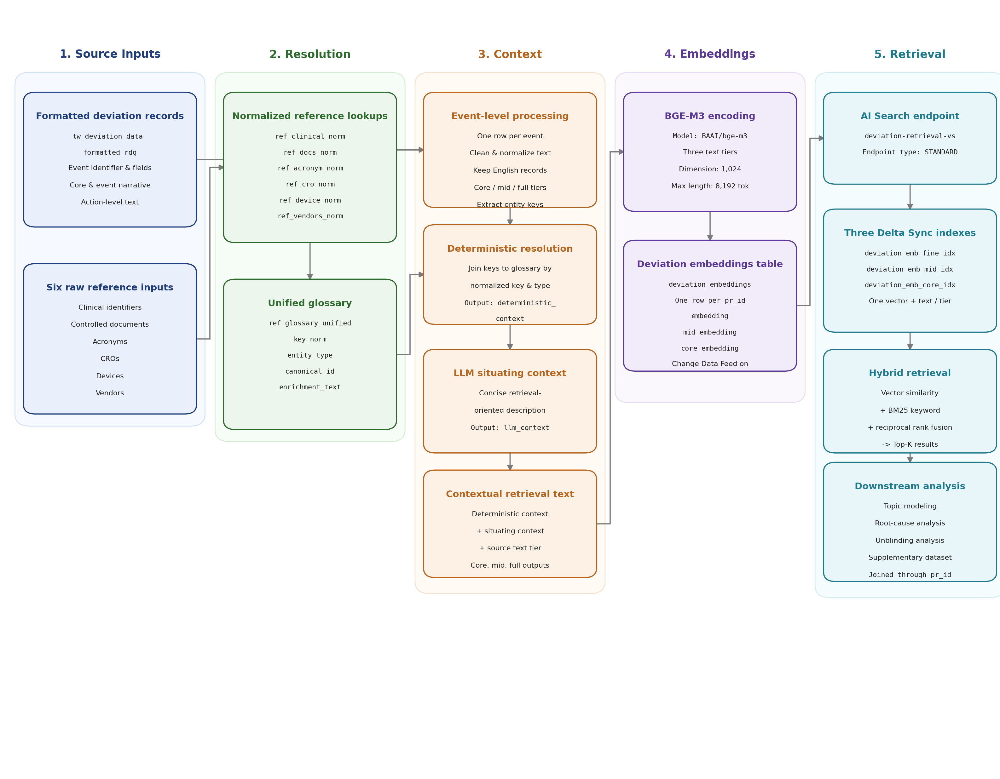
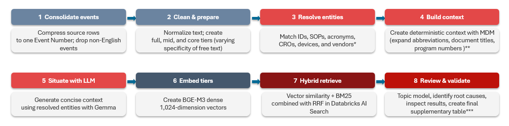

| **Author:** Erin Xu
| **Manager:** Saeed Babaeizadeh
| **Team:** R&D Quality
| **Github repository:** QDN space, TBA

## Purpose

This document is intended for technical stakeholders to reference when reviewing the proof-of-concept implementation of a context-aware natural language processing (NLP) enrichment and retrieval workflow for pharmaceutical deviation records. It describes the problem statement, objectives, data flow, storage organization, inputs, outputs produced by the pipeline, how to run the workflow, how to use the semantic-search layer to build retrieval cohorts for specific business questions, interpreting hard-coded statistics configured in the reporting layer, the justification of this methodology, conceptual breakdowns of the scientific concepts behind this technology, future work and next steps.

## Problem Statement

Quality Data Navigator (QDN) provides a governed platform for structured quality data, but the narrative text associated with pharmaceutical deviations remains difficult to query and analyze systematically. These narratives contain operational context, referenced entities, recurring themes, and root-cause signals that are not fully represented in existing structured fields. **This work extends QDN’s foundation to the unstructured record, by turning them into structured signals that support faster, more consistent quality insight generation.**


## Objectives

This project develops a context-aware NLP enrichment and retrieval workflow for pharmaceutical deviation records. Rather than analyzing only the deviation title and description, the workflow constructs tiered text representations across event narratives, quality and impact assessments, structured root-cause descriptions, and action text, at both event and action-record grains. These representations support entity extraction and normalization, contextual enrichment, embeddings, topic and root-cause analysis, vector indexing, and semantic and hybrid retrieval.

The following capabilities of the project are in scope: 

1. Demonstrate that heterogeneous free-text fields can be consolidated into reproducible core, mid, and full deviation representations while preserving event and action-record grain.
2. Extract and normalize relevant entity-level information from the available narrative and descriptive fields.
3. Connect deviation records with relevant contextual and reference sources.
4. Produce enriched text suitable for embeddings and downstream NLP analysis.
5. Support both concept-based and exact-term retrieval.
6. Identify interpretable topics and root-cause signals.
7. Retain links to source fields and supporting evidence for review.
8. Produce a supplementary dataset that can be joined back to QDN data using a documented event identifier.

The following capabilities are out of scope for this project:

- Production deployment, operational support, or service-level commitments.
- Direct integration of the supplementary dataset or retrieval indexes into the production QDN application. This project produces a supplementary dataset and retrieval indexes that can be joined back to QDN data using a documented event identifier, but does not modify the production QDN application or its governed data.
- Real-time or incremental processing of newly created or updated deviation records. Production serving, continuous processing, operational monitoring, retraining, and lifecycle management require separate productionization and governance work.
- Automated quality decisions, record disposition, compliance determinations, or replacement of subject-matter-expert review.
- Changes to source-system records or existing governed QDN fields.
- Automated remediation of missing, inconsistent, or incorrect source data.
- Comprehensive extraction of every possible entity type or terminology variant.

## Accessing the Results 
1. If you want to look at the complete embedding table: `us_gmsgq_dev.gms_us_mart.deviation_embeddings`
2. If you want to look at the QDN supplementary table: `us_gmsgq_dev.gms_us_mart.deviation_supplementary`
3. To query hybrid search, use the AI Search endpoint: `deviation-retrieval-vs-qdn`. See later section for more detail. 

## Running the Code

The workflow is a set of Databricks notebooks that must be run in **dependency
order**: each writes Delta tables or vector indexes that later notebooks read. But, they don't need to be run less there is a need for data refresh. Running the later analysis notebooks without refreshing the foundation tables will produce the same outputs as the last run. The notebooks are designed to be idempotent and can be re-run multiple times without changing the outputs, provided that the source data has not changed. Editing the downstream notebooks to produce more heuristics is supported and will not require re-running the foundation notebooks unless the source data has changed.


Here is the full process anyways. Run the cells top-to-bottom within each notebook. `build_reference_glossary` is the
foundation and must run first; the reporting notebook runs last.

1. `build_reference_glossary.ipynb`. Normalizes the six reference
   datasets into `ref_glossary_unified`, compresses the deviation source to event
   grain, resolves entities, generates the LLM situating context, builds the
   three-tier BGE-M3 embeddings (`deviation_embeddings`), and creates the AI Search
   endpoint and the three Delta Sync indexes. Everything downstream depends on its
   outputs.

2. `topic_modeling.ipynb`. Reads `deviation_embeddings` and assigns
   interpretable topics with zero-shot BERTopic, writing `deviation_topics` and the
   primary/secondary/tertiary labels in `deviation_topic_assignments`.

3. `root_cause.ipynb`. Reads `deviation_embeddings` plus the human
   `Root_Cause_Category` from the source mart and writes the LLM Ishikawa (6M)
   root-cause judgement per event to `deviation_root_cause`. It is independent of
   `topic_modeling`—once step 1 is done, steps 2 and 3 may run in either order.

4. `create_supplementary_table.ipynb`. Joins the resolved entities, personnel,
   location, topics (step 2), and root cause (step 3) into the analysis-facing
   `deviation_supplementary`, one row per event. Requires steps 1–3.

5. `unblinding_semantic_search.ipynb`. A read-only consumer of the retrieval
   stack: builds thematic cohorts (inadvertent unblinding, protocol deviations) by
   unioning a native-HYBRID semantic search with a keyword regex, and writes
   `unblinding_cohort`. Requires the indexes from step 1; independent of steps 2–4.

6. `deviation_statistics.ipynb` — run last. The reporting layer. Reads the
   supplementary table, topics, root causes, and the unblinding cohort to produce
   summary statistics, figures, SME review worklists, and the curated
   `deviation_triage` export. Requires steps 1–5.

## Overview of Data Flow

The pipeline combines formatted TrackWise deviation records with six supporting reference datasets. Reference records are normalized into a common lookup contract and consolidated into a unified glossary. Deviation records are then compressed to one row per event, cleaned, filtered to the supported language scope, resolved against the glossary, and represented at three levels of narrative detail.

A Databricks-hosted foundation model generates a short situating context for each deviation. The deterministic reference context, generated context, and source text are combined into contextual retrieval text. BGE-M3 converts each text tier into a 1,024-dimensional dense vector. Three Databricks AI Search indexes expose the resulting core, mid, and full representations for hybrid vector and keyword retrieval. These are then used for topic discovery, root-cause analysis, cohort retrieval, and other heuristics.

The two figures below show the big picture overview of the workflow at decreasing levels of abstraction. The pipeline resolves reference entities before generating situating context and constructing the three embedding representations.

{#fig-principal-data-flow fig-align="center" width=100% height=45%}

{#fig-supplementary fig-align="center" width=100%}

## Engineering: Text Preparation and Filtering

Before text construction, the pipeline:

1. Applies Unicode normalization.
2. Standardizes Unicode hyphens and non-breaking spaces.
3. Folds accented Latin characters for matching.
4. Normalizes repeated spaces and excessive blank lines.
5. Preserves letter case because acronym and CRO extraction depend on case-sensitive source information.
6. Applies language detection to the combined `Event_Title` and `Event_Description`.
7. Retains records classified as English, including supported code-only records.
8. Applies an additional guard against remaining CJK characters in the title and description.
9. Excludes records whose resulting full text is empty.

Language detection is seeded to make repeated runs reproducible.

The English-language filter is based on the core title and description, not independently on every source field. This behavior should be retained in the documented acceptance criteria and reviewed if multilingual coverage is later required.

## Engineering: Event-Grain Reconciliation

The source table may contain multiple rows for the same `Event_Number` because `Action_Text` is handled at a row grain below the deviation event. Before downstream enrichment, the pipeline compresses the source to one row per event:

- Event-stable fields use the first available non-null value.
- Distinct non-null `Action_Text` values are collected and joined into a single text field.
- `Event_Number` is cast to a string and renamed `pr_id`.
- Duplicate action text is removed during aggregation.

This produces the event-level grain expected by the embedding table, vector indexes, and supplementary outputs.

## Storage Organization

All persistent data objects used by the proof of concept are located in the development Unity Catalog.

+-------------------+-------------------------------+------------------------------------------------------------------+
| Logical layer     | Namespace                     | Contents                                                         |
+===================+===============================+==================================================================+
| Development       | `us_gmsgq_dev`                | Catalog containing the proof-of-concept data objects             |
| catalog           |                               |                                                                  |
+-------------------+-------------------------------+------------------------------------------------------------------+
| Mart layer        | `us_gmsgq_dev.gms_us_mart`    | Read-only formatted deviation source                             |
+-------------------+-------------------------------+------------------------------------------------------------------+
| Analytics layer   | `us_gmsgq_dev.gms_us_alyt`    | Reference inputs, normalized lookups, enrichment tables,         |
|                   |                               | embeddings, and retrieval indexes                                |
+-------------------+-------------------------------+------------------------------------------------------------------+

The mart table is treated as a read-only input. The pipeline writes derived data products to the analytics schema. These are development resources and do not represent a production deployment.

## Input: Formatted TrackWise Deviation Dataset

+-----------------------------+--------------------------------------------------------------------------------------+
| Attribute                   | Value                                                                                |
+=============================+======================================================================================+
| Logical name                | Formatted TrackWise deviation data                                                   |
+-----------------------------+--------------------------------------------------------------------------------------+
| Fully qualified table       | `us_gmsgq_dev.gms_us_mart.tw_deviation_data_formatted_rdq`                            |
+-----------------------------+--------------------------------------------------------------------------------------+
| Pipeline role               | Primary source of deviation identifiers, narrative fields, assessments, root-cause   |
|                             | fields, and action text                                                              |
+-----------------------------+--------------------------------------------------------------------------------------+
| Read/write behavior         | Read only                                                                            |
+-----------------------------+--------------------------------------------------------------------------------------+
| Pipeline event identifier   | `Event_Number`                                                                       |
+-----------------------------+--------------------------------------------------------------------------------------+
| Derived event identifier    | `pr_id`, created by casting `Event_Number` to string                                 |
+-----------------------------+--------------------------------------------------------------------------------------+
| Target processing grain     | One row per deviation event                                                          |
+-----------------------------+--------------------------------------------------------------------------------------+

\newpage 

## Input: Reference Data

The pipeline uses six reference datasets to resolve entities found in deviation records. Sources that live in Databricks (the Veeva controlled-document table and the vendor MDM) refresh on their own and are marked Dynamic; the SharePoint and CTMS exports are point-in-time snapshots and are marked Static. 

| Entity domain | Source location | Refresh | Raw input table | Primary source fields used | Pipeline purpose |
|:-----------|:----------------|:------|:----------------|:-------------------------|:----------------|
| Clinical identifiers | Excel, SharePoint, self-refreshing MDM | Static | `us_gmsgq_dev.gms_us_alyt.Clinicalid_deviations` | `Parent_Node`, `Name`, `Protocol Number`, `Alternate_Name`, `Development_Name`, `Parent_Alias`, `Grand_Parent`, `Grandparent_Alias`, and available contextual attributes | Resolve clinical program, compound, protocol, and study identifiers |
| Controlled documents | Veeva (Databricks) | Dynamic | `us_gmsgq_dev.gms_us_alyt.documents_number_deviations` | `document_number__v`, `previous_document_number__c`, `legacy_numbers__c`, `title__v` | Resolve current, previous, and legacy controlled-document numbers |
| Acronyms | SharePoint | Static | `us_gmsgq_dev.gms_us_alyt.Acronyms_other_deviations` | `Acronym`, `Definition`, `Category` | Resolve supported medical and industry acronyms |
| CROs | Vendor MDM (Databricks) | Dynamic | `us_gmsgq_dev.gms_us_alyt.cro_deviations` | `Name`, `Display Name`, `description` | Resolve known CRO names and add descriptive context |
| Devices | CTMS (available elsewhere) | Static | `us_gmsgq_dev.gms_us_alyt.rd_device_list_deviations` | `Name`, `Alias`, `Device_Long_name`, `Device_Type`, `business_owner` | Resolve device-name variants and add type and ownership context |
| Vendors | Vendor MDM (Databricks) | Dynamic | `us_gmsgq_dev.gms_us_alyt.supplier_list_deviations` | `Supplier_Name_RD`, `Country_RD` | Resolve known external supplier names and country context |

## Entity-Specific Resolution Rules

### Clinical Identifiers

Clinical identifiers are resolved from three source paths:

1. Pattern-based extraction from the combined deviation text.
2. Values in `Study_Protocol`, split on semicolons and treated as trusted clinical values after removal of null-like entries.
3. Values in `Program_Number`, split on semicolons and retained only when the leading token matches a supported clinical-ID family.

The implemented identifier families include supported TAK, MLN, SHP, HGT, CCT, DEN, and internal C-number patterns. Both canonical complete identifiers and normalized parent or compound keys may be retained for matching.

### Controlled Documents

The pipeline extracts supported SOP, SPEC, MTHD, MTD, PROC, TOOL, FORM, and WI identifiers from free text and `Document_or_Process`. Current, previous, and legacy document-number fields from the reference input are normalized to a common key format.

### Acronyms

Acronym extraction follows a known-set approach:

- Candidate uppercase expressions are detected in source text.
- Only candidates present in the normalized acronym reference are retained.
- One- and two-character entries are excluded.
- Values resembling supported clinical or document identifiers are excluded to avoid entity-type collisions.
- Medical and Industry definitions are retained.
- Selected British spelling variants are normalized before definition deduplication.

### CROs, Devices, and Vendors

CROs, devices, and vendors are matched against known normalized names using substring matching:

- CRO names shorter than four characters are excluded.
- Device names, aliases, and long names shorter than four characters are excluded.
- Vendor names shorter than four characters are excluded.
- Device business-owner abbreviations are expanded where mappings are configured.
- Matching remains dependent on the coverage and quality of each reference table.

These methods favor interpretable, reference-grounded matches. They do not constitute comprehensive named-entity recognition for all possible organizations, devices, suppliers, or terminology variants.


## Output: Text Tiers

The pipeline constructs three source-text representations for every retained event.

+--------+---------------------------+--------------------------------------------+-----------------------------------+
| Tier   | Implementation field      | Included source fields                     | Intended role                     |
+========+===========================+============================================+===================================+
| Core   | `source_free_text_core`   | `Event_Title` and `Event_Description`      | Concise representation of the     |
|        |                           |                                            | primary deviation narrative       |
+--------+---------------------------+--------------------------------------------+-----------------------------------+
| Mid    | `source_free_text_mid`    | Core fields plus `Impact_Assessment`,      | Event-level representation with   |
|        |                           | `Quality_Final_Assessment`,                | assessment and root-cause context |
|        |                           | `Root_Cause_Category`, and                 |                                   |
|        |                           | `Root_Cause_SubCategory`                   |                                   |
+--------+---------------------------+--------------------------------------------+-----------------------------------+
| Full   | `source_free_text_full`   | Mid fields plus aggregated `Action_Text`   | Most detailed representation,     |
|        |                           |                                            | including action-record           |
|        |                           |                                            | information                       |
+--------+---------------------------+--------------------------------------------+-----------------------------------+

The BGE-M3 and AI Search implementation also refers to the full tier as the fine tier. In this document, full describes the text representation and fine index refers to the corresponding implementation object.

## Output: Contextualized Embedding

### Persistent Enrichment Table

+-----------------------------+-------------------------------------------------------------------------------------+
| Attribute                   | Value                                                                               |
+=============================+=====================================================================================+
| Fully qualified table       | `us_gmsgq_dev.gms_us_alyt.deviation_embed_input`                                     |
+-----------------------------+-------------------------------------------------------------------------------------+
| Grain                       | One row per retained `pr_id`                                                         |
+-----------------------------+-------------------------------------------------------------------------------------+
| Primary purpose             | Store source text, deterministic reference context, generated situating context,    |
|                             | and final contextual retrieval text                                                 |
+-----------------------------+-------------------------------------------------------------------------------------+
| Write behavior              | Overwrite through a staging table                                                   |
+-----------------------------+-------------------------------------------------------------------------------------+
| Temporary staging tables    | `deviation_embed_input_staging` and `deviation_embed_input_stg`                     |
+-----------------------------+-------------------------------------------------------------------------------------+
| Downstream consumers        | Embedding generation and retrieval workflow                                         |
+-----------------------------+-------------------------------------------------------------------------------------+

### Output Fields

+---------------------------+------------------------------------------------------------+-------------------------------------------------+
| Field group               | Fields                                                     | Description                                     |
+===========================+============================================================+=================================================+
| Event identifier          | `pr_id`                                                    | String representation of `Event_Number`         |
+---------------------------+------------------------------------------------------------+-------------------------------------------------+
| Source text               | `source_free_text_full`, `source_free_text_mid`,           | Cleaned source text at three levels of detail   |
|                           | `source_free_text_core`                                    |                                                 |
+---------------------------+------------------------------------------------------------+-------------------------------------------------+
| Deterministic enrichment  | `deterministic_context`                                    | Resolved and concatenated reference information |
+---------------------------+------------------------------------------------------------+-------------------------------------------------+
| Generated enrichment      | `llm_context`                                              | Short model-generated paragraph situating the   |
|                           |                                                            | deviation using source and resolved reference   |
|                           |                                                            | context                                         |
+---------------------------+------------------------------------------------------------+-------------------------------------------------+
| Contextual retrieval text | `contextual_retrieval_text_full`,                          | Final text passed to embeddings and             |
|                           | `contextual_retrieval_text_mid`,                           | synchronized for keyword retrieval              |
|                           | `contextual_retrieval_text_core`                           |                                                 |
+---------------------------+------------------------------------------------------------+-------------------------------------------------+

Each contextual retrieval field is assembled in this order: Resolved deterministic references + LLM-generated situating context + Source free text for the selected tier.

The original source-text tiers remain stored separately so that generated or resolved context does not replace source evidence.

### Generated Situating Context

The pipeline calls a Databricks-hosted foundation model through `ai_query`. The configured model identifier is ```databricks-gpt-5-4-mini```. 

For each non-empty event, the prompt supplies:

- `deterministic_context`
- `source_free_text_full`
- Instructions to produce a short retrieval-oriented description of the entities involved and the subject of the deviation

The configured generation parameters are:

+----------------------------+--------------------+
| Parameter                  | Configured value   |
+============================+===================:+
| Maximum generated tokens   | 300                |
+----------------------------+--------------------+
| Temperature                | 0.0                |
+----------------------------+--------------------+

The generated result is stored as `llm_context` and reused across the full, mid, and core contextual retrieval representations. It is generated context, not source evidence. Reviewers should use the retained source fields and deterministic references when validating its contents.


### Deviation Embeddings Table

+-------------------------------------+----------------------------------------------------+
| Attribute                           | Value                                              |
+=====================================+====================================================+
| Fully qualified table               | `us_gmsgq_dev.gms_us_alyt.deviation_embeddings`    |
+-------------------------------------+----------------------------------------------------+
| Grain                               | One row per `pr_id`                                |
+-------------------------------------+----------------------------------------------------+
| Primary key                         | `pr_id`                                            |
+-------------------------------------+----------------------------------------------------+
| Change Data Feed                    | Enabled                                            |
+-------------------------------------+----------------------------------------------------+
| Embedding model                     | `BAAI/bge-m3`                                       |
+-------------------------------------+----------------------------------------------------+
| Embedding dimension                 | 1,024                                              |
+-------------------------------------+----------------------------------------------------+
| Configured maximum sequence length  | 8,192 tokens                                       |
+-------------------------------------+----------------------------------------------------+
| Configured batch size               | 64                                                 |
+-------------------------------------+----------------------------------------------------+
| Number of text tiers                | Three                                              |
+-------------------------------------+----------------------------------------------------+
| Write behavior                      | Overwrite for the first write chunk; append for    |
|                                     | subsequent chunks                                  |
+-------------------------------------+----------------------------------------------------+

### Embedding Fields

+-------------+----------------------------------------+------------------+
| Text tier   | Contextual text input                  | Vector output    |
+=============+========================================+==================+
| Full/fine   | `contextual_retrieval_text_full`       | `embedding`      |
+-------------+----------------------------------------+------------------+
| Mid         | `contextual_retrieval_text_mid`        | `mid_embedding`  |
+-------------+----------------------------------------+------------------+
| Core        | `contextual_retrieval_text_core`       | `core_embedding` |
+-------------+----------------------------------------+------------------+

The three text lists are combined into one encoding workload, sorted approximately by token length to reduce unnecessary padding, encoded, restored to their original order, and split back into the three vector columns.

The embedding table also retains:

- `source_free_text_full`
- `source_free_text_mid`
- `source_free_text_core`
- `deterministic_context`
- `llm_context`
- `contextual_retrieval_text_full`
- `contextual_retrieval_text_mid`
- `contextual_retrieval_text_core`

Retaining these fields preserves the relationship between each vector and the text from which the vector was generated.

## Output: Normalized Lookup Tables

+---------------------------+--------------------------------------------------+---------------------------------------------------------------------+
| Entity type               | Normalized output table                          | Normalization and enrichment summary                                |
+===========================+==================================================+=====================================================================+
| `CLINICAL_ID`             | `us_gmsgq_dev.gms_us_alyt.ref_clinical_norm`     | Creates keys from available clinical aliases and adds generic name, |
|                           |                                                  | modality, therapeutic area, finance grouping, indication, target,   |
|                           |                                                  | and mechanism where available                                       |
+---------------------------+--------------------------------------------------+---------------------------------------------------------------------+
| `DOCUMENT`                | `us_gmsgq_dev.gms_us_alyt.ref_docs_norm`         | Normalizes current, previous, and legacy document numbers; maps the |
|                           |                                                  | legacy `MTD` prefix to `MTHD`; adds document title                  |
+---------------------------+--------------------------------------------------+---------------------------------------------------------------------+
| `ACRONYM`                 | `us_gmsgq_dev.gms_us_alyt.ref_acronym_norm`      | Retains supported Medical and Industry definitions, removes short   |
|                           |                                                  | or invalid entries, excludes identifier-like values, and            |
|                           |                                                  | consolidates definitions by acronym                                 |
+---------------------------+--------------------------------------------------+---------------------------------------------------------------------+
| `CRO`                     | `us_gmsgq_dev.gms_us_alyt.ref_cro_norm`          | Uses normalized CRO names as keys and adds name, display name, and  |
|                           |                                                  | description                                                         |
+---------------------------+--------------------------------------------------+---------------------------------------------------------------------+
| `DEVICE`                  | `us_gmsgq_dev.gms_us_alyt.ref_device_norm`       | Creates lowercase name, alias, and long-name variants and adds      |
|                           |                                                  | device type and expanded business-owner context                     |
+---------------------------+--------------------------------------------------+---------------------------------------------------------------------+
| `VENDOR`                  | `us_gmsgq_dev.gms_us_alyt.ref_vendors_norm`      | Uses normalized supplier names as keys and adds supplier name and   |
|                           |                                                  | country                                                             |
+---------------------------+--------------------------------------------------+---------------------------------------------------------------------+
| All supported entities    | `us_gmsgq_dev.gms_us_alyt.ref_glossary_unified`  | Unions the six normalized lookup tables and retains one row per     |
|                           |                                                  | `key_norm` and `entity_type`                                        |
+---------------------------+--------------------------------------------------+---------------------------------------------------------------------+

## Output: Retrieval 

### AI Search Endpoint

+-----------------------+----------------------------------------------------------+
| Attribute             | Value                                                    |
+=======================+==========================================================+
| Endpoint name         | `deviation-retrieval-vs-qdn`                             |
+-----------------------+----------------------------------------------------------+
| Endpoint type         | `STANDARD`                                               |
+-----------------------+----------------------------------------------------------+
| Environment           | Development                                              |
+-----------------------+----------------------------------------------------------+
| Authentication        | Notebook credentials detected by the AI Search client    |
+-----------------------+----------------------------------------------------------+

### Delta Sync Indexes

+-------------+--------------------------------------------------------+------------------+-----------------------------------+
| Tier        | Index                                                  | Vector field     | Searchable text field             |
+=============+========================================================+==================+===================================+
| Full/fine   | `us_gmsgq_dev.gms_us_alyt.deviation_emb_fine_idx`      | `embedding`      | `contextual_retrieval_text_full`  |
+-------------+--------------------------------------------------------+------------------+-----------------------------------+
| Mid         | `us_gmsgq_dev.gms_us_alyt.deviation_emb_mid_idx`       | `mid_embedding`  | `contextual_retrieval_text_mid`   |
+-------------+--------------------------------------------------------+------------------+-----------------------------------+
| Core        | `us_gmsgq_dev.gms_us_alyt.deviation_emb_core_idx`      | `core_embedding` | `contextual_retrieval_text_core`  |
+-------------+--------------------------------------------------------+------------------+-----------------------------------+

Each index:

- Uses `deviation_embeddings` as its source table.
- Uses `pr_id` as the primary key.
- Uses a precomputed 1,024-dimensional BGE-M3 vector.
- Uses a triggered Delta Sync pipeline.
- Synchronizes the tier-specific contextual retrieval text for keyword retrieval.
- Does not ask Databricks AI Search to recompute the stored embeddings.

At query time, the retrieval workflow supplies:

- A BGE-M3 query vector for semantic similarity.
- The original query text for keyword matching.
- `HYBRID` as the query type.

Databricks AI Search returns the combined ranking from vector and keyword retrieval. The notebook returns the top configured results for the selected tier.

## Output: Supplementary Table

The supplementary table is the analysis-facing product of the workflow. It is built on top of the formatted TrackWise source and the enrichment tables, collapsing the date- or row-grain source to one row per event and joining the parsed deterministic entities, personnel, location, discovered topics, and root-cause signals to each deviation. It can be joined back to QDN data through the documented event identifier.

+----------------------+----------------------------------------------------------------------------+
| Attribute            | Value                                                                      |
+======================+============================================================================+
| Fully qualified      | `us_gmsgq_dev.gms_us_alyt.deviation_supplementary`                         |
| table                |                                                                            |
+----------------------+----------------------------------------------------------------------------+
| Grain                | One row per event (`pr_id`, equal to `Event_Number`)                       |
+----------------------+----------------------------------------------------------------------------+
| Primary purpose      | Join enriched entities, personnel, location, topics, and root-cause        |
|                      | signals back to each deviation event for analysis and review               |
+----------------------+----------------------------------------------------------------------------+
| Key source           | `us_gmsgq_dev.gms_us_mart.tw_deviation_data_formatted_rdq` (event key,     |
|                      | personnel, and location text)                                              |
+----------------------+----------------------------------------------------------------------------+
| Enrichment source    | `us_gmsgq_dev.gms_us_alyt.deviation_embeddings` (source text, contextual   |
|                      | retrieval text, and deterministic context)                                 |
+----------------------+----------------------------------------------------------------------------+
| Additional sources   | `deviation_topic_assignments` (zero-shot BERTopic topics) and              |
|                      | `deviation_root_cause` (LLM root cause)                                    |
+----------------------+----------------------------------------------------------------------------+
| Write behavior       | Overwrite with schema overwrite enabled                                    |
+----------------------+----------------------------------------------------------------------------+
| Join key             | `pr_id`, cast to string, left-joined across all contributing tables        |
+----------------------+----------------------------------------------------------------------------+

## Output: Supplementary Fields

+------------------+------------------------------------------+--------------------------------------------------------------+
| Field group      | Fields                                   | Description                                                  |
+==================+==========================================+==============================================================+
| Event identifier | `Event_Number`                           | Event key restored from `pr_id`; one row per event           |
+------------------+------------------------------------------+--------------------------------------------------------------+
| Source text      | `source_free_text_full`                  | Cleaned deviation free text spanning all source fields       |
+------------------+------------------------------------------+--------------------------------------------------------------+
| Contextual       | `contextual_retrieval_text_full`         | Enriched text (deterministic references + generated          |
| retrieval text   |                                          | situating context + source text)                             |
+------------------+------------------------------------------+--------------------------------------------------------------+
| Deterministic    | `deterministic_context`                  | Raw resolved-references blob retained for reference          |
| enrichment       |                                          |                                                              |
+------------------+------------------------------------------+--------------------------------------------------------------+
| Parsed entities  | `clinical_ids`, `documents`, `acronyms`, | Typed arrays parsed from `deterministic_context`,            |
|                  | `cros`, `devices`, `vendors`             | deduplicated in first-seen order and preferring the resolved |
|                  |                                          | canonical name                                               |
+------------------+------------------------------------------+--------------------------------------------------------------+
| Personnel        | `personnel`                              | Distinct non-null names collected from `Event_Owner`,        |
|                  |                                          | `QA_Contact`, `Reported_by`, and                             |
|                  |                                          | `Quality_Approver_CAPA_Final`                                |
+------------------+------------------------------------------+--------------------------------------------------------------+
| Local Operating  | `LOC`                                    | Array of inferred countries from name, agency, ccTLD, and    |
| Company          |                                          | adjacent-code signals; `[LOC]` when only the structured      |
|                  |                                          | operational-unit flag is present, otherwise empty            |
+------------------+------------------------------------------+--------------------------------------------------------------+
| Topics           | `primary_topic`, `secondary_topic`,      | Zero-shot BERTopic (BGE-M3) topic labels; null when the      |
|                  | `tertiary_topic`                         | topic table is unavailable                                   |
+------------------+------------------------------------------+--------------------------------------------------------------+
| Root cause       | `llm_rc_primary`, `llm_rc_secondary`,    | LLM-judged primary root cause (Ishikawa 6M) and first two    |
|                  | `llm_rc_tertiary`                        | contributing factors; null when the root-cause table is      |
|                  |                                          | unavailable                                                  |
+------------------+------------------------------------------+--------------------------------------------------------------+

The parsed entity, personnel, and `LOC` fields are stored as string arrays. The topic and root-cause fields are populated by optional upstream tables; when those tables are absent, the pipeline writes the columns as nulls so that the supplementary schema remains stable. The full source and contextual retrieval text are retained alongside the extracted fields so that every derived value can be traced back to its supporting evidence.

\newpage

## Input-to-Output Lineage

+-------------------------------------------+----------------------------------------------------+---------------------------------+-------------------------------------------------+
| Input                                     | Principal transformation                           | Persistent output               | Downstream use                                  |
+===========================================+====================================================+=================================+=================================================+
| `Clinicalid_deviations`                   | Alias parsing, clinical-ID normalization,          | `ref_clinical_norm`             | Unified glossary and deterministic enrichment   |
|                                           | contextual-field assembly                          |                                 |                                                 |
+-------------------------------------------+----------------------------------------------------+---------------------------------+-------------------------------------------------+
| `documents_number_deviations`             | Current, previous, and legacy document             | `ref_docs_norm`                 | Unified glossary and deterministic enrichment   |
|                                           | normalization                                      |                                 |                                                 |
+-------------------------------------------+----------------------------------------------------+---------------------------------+-------------------------------------------------+
| `Acronyms_other_deviations`               | Filtering, normalization, definition               | `ref_acronym_norm`              | Acronym extraction, glossary enrichment, and    |
|                                           | consolidation                                      |                                 | selected abbreviation expansion                 |
+-------------------------------------------+----------------------------------------------------+---------------------------------+-------------------------------------------------+
| `cro_deviations`                          | CRO-name filtering and normalization               | `ref_cro_norm`                  | Known-set CRO extraction and enrichment         |
+-------------------------------------------+----------------------------------------------------+---------------------------------+-------------------------------------------------+
| `rd_device_list_deviations`               | Name, alias, and long-name normalization           | `ref_device_norm`               | Known-set device extraction and enrichment      |
+-------------------------------------------+----------------------------------------------------+---------------------------------+-------------------------------------------------+
| `supplier_list_deviations`                | Supplier-name normalization                        | `ref_vendors_norm`              | Known-set vendor extraction and enrichment      |
+-------------------------------------------+----------------------------------------------------+---------------------------------+-------------------------------------------------+
| Six normalized references                 | Schema alignment, union, and deduplication         | `ref_glossary_unified`          | Single reference join for all supported entity  |
|                                           |                                                    |                                 | types                                           |
+-------------------------------------------+----------------------------------------------------+---------------------------------+-------------------------------------------------+
| `tw_deviation_data_formatted_rdq`         | Event aggregation, text cleaning, language         | `deviation_embed_input`         | Context generation and embedding                |
|                                           | filtering, text-tier construction, and entity      |                                 |                                                 |
|                                           | extraction                                         |                                 |                                                 |
+-------------------------------------------+----------------------------------------------------+---------------------------------+-------------------------------------------------+
| `deviation_embed_input`                   | BGE-M3 dense encoding of three contextual text     | `deviation_embeddings`          | Vector and hybrid retrieval                     |
|                                           | tiers                                              |                                 |                                                 |
+-------------------------------------------+----------------------------------------------------+---------------------------------+-------------------------------------------------+
| `deviation_embeddings`                    | Triggered Delta Sync indexing                      | Three AI Search indexes         | Core, mid, and full/fine retrieval              |
+-------------------------------------------+----------------------------------------------------+---------------------------------+-------------------------------------------------+

## Output: Temporary and Diagnostic 

The following objects or results support safe execution and validation but are not canonical downstream data products.

+-------------------------------------+--------------------------------------------------------------------+------------------------------------+
| Artifact                            | Purpose                                                            | Persistence                        |
+=====================================+====================================================================+====================================+
| `deviation_embed_input_staging`     | Materializes the event-level embedding input before replacing the | Temporary; dropped after the write |
|                                     | canonical table                                                   |                                    |
+-------------------------------------+--------------------------------------------------------------------+------------------------------------+
| `deviation_embed_input_stg`         | Materializes model-generated context before replacing the         | Temporary; dropped after the write |
|                                     | canonical table                                                   |                                    |
+-------------------------------------+--------------------------------------------------------------------+------------------------------------+
| Entity extraction coverage          | Counts events with at least one extracted key by entity type      | Notebook diagnostic                |
+-------------------------------------+--------------------------------------------------------------------+------------------------------------+
| Reference join coverage             | Compares extracted keys with keys matched to the unified glossary | Notebook diagnostic                |
+-------------------------------------+--------------------------------------------------------------------+------------------------------------+
| Unmatched-key report                | Lists frequently extracted keys without a reference match         | Notebook diagnostic                |
+-------------------------------------+--------------------------------------------------------------------+------------------------------------+
| LLM-context coverage                | Counts populated and empty `llm_context` values                    | Notebook diagnostic                |
+-------------------------------------+--------------------------------------------------------------------+------------------------------------+
| Embedding integrity checks          | Checks row counts, distinct `pr_id` values, vector dimensions,     | Notebook diagnostic                |
|                                     | and context coverage                                              |                                    |
+-------------------------------------+--------------------------------------------------------------------+------------------------------------+
| Index-status checks                 | Reports index state and indexed-row counts                        | Notebook diagnostic                |
+-------------------------------------+--------------------------------------------------------------------+------------------------------------+


## Technical Dependencies

The pipeline was developed and tested on Databricks Serverless compute. Because the
`%pip install` cells do not pin exact versions, the versions below were captured from
the running environment for reproducibility. 

### Runtime environment

+-----------------------------+--------------------------------------------------+
| Item                        | Value                                            |
+=============================+==================================================+
| Compute type                | Databricks Serverless                            |
+-----------------------------+--------------------------------------------------+
| Serverless environment ver. | `[capture]` (Notebook → Environment panel)       |
+-----------------------------+--------------------------------------------------+
| Python                      | 3.12.3                                           |
+-----------------------------+--------------------------------------------------+
| GPU / CUDA                  | Required for FP16 BGE-M3; CUDA 12.9              |
|                             | (`torch` 2.9.0+cu129)                            |
+-----------------------------+--------------------------------------------------+

### Python packages (captured versions)

+---------------------------+----------------+------------------------------------------------+
| Package                   | Version        | Role                                           |
+===========================+================+================================================+
| `FlagEmbedding`           | 1.4.0          | BGE-M3 model loading and dense vector          |
|                           |                | generation                                     |
+---------------------------+----------------+------------------------------------------------+
| `torch`                   | 2.9.0+cu129    | GPU tensor backend (CUDA 12.9) for BGE-M3      |
+---------------------------+----------------+------------------------------------------------+
| `transformers`            | 4.57.6         | Model and tokenizer dependency                 |
+---------------------------+----------------+------------------------------------------------+
| `bertopic`                | 0.17.4         | Zero-shot topic modeling                       |
+---------------------------+----------------+------------------------------------------------+
| `umap-learn`              | 0.5.9.post2    | Dimensionality reduction for BERTopic          |
+---------------------------+----------------+------------------------------------------------+
| `hdbscan`                 | 0.8.44         | Density-based clustering for BERTopic          |
+---------------------------+----------------+------------------------------------------------+
| `scikit-learn`            | 1.6.1          | CountVectorizer (c-TF-IDF) and cluster metrics |
+---------------------------+----------------+------------------------------------------------+
| `databricks-ai-search`    | 0.78           | Endpoint and Delta Sync index management and   |
|                           |                | querying                                       |
+---------------------------+----------------+------------------------------------------------+
| `openai`                  | 3.0.0          | Client for the LLM classification endpoint     |
+---------------------------+----------------+------------------------------------------------+
| `langdetect`              | 1.0.9          | Reproducible English-language filtering        |
+---------------------------+----------------+------------------------------------------------+
| `numpy`                   | 2.1.3          | Vector-order restoration and array handling    |
+---------------------------+----------------+------------------------------------------------+
| `pandas`                  | 2.2.3          | Driver-side transfer for embedding generation  |
+---------------------------+----------------+------------------------------------------------+
| PySpark                   | (Serverless)   | Source aggregation, joins, and Delta writes    |
+---------------------------+----------------+------------------------------------------------+

### Model and endpoint configuration

+-------------------------------------+------------------------------------------------------+
| Item                                | Value                                                |
+=====================================+======================================================+
| Embedding model                     | `BAAI/bge-m3`                                         |
+-------------------------------------+------------------------------------------------------+
| Embedding model revision (commit)   | `[capture]` (Hugging Face snapshot hash)             |
+-------------------------------------+------------------------------------------------------+
| Embedding dimension                 | 1,024                                                |
+-------------------------------------+------------------------------------------------------+
| Max sequence length                 | 8,192 tokens                                          |
+-------------------------------------+------------------------------------------------------+
| Situating-context FM endpoint       | `databricks-gpt-5-4-mini` (`ai_query`)               |
+-------------------------------------+------------------------------------------------------+
| Situating-context params            | `temperature=0.0`, `max_tokens=300`                  |
+-------------------------------------+------------------------------------------------------+
| Topic-classifier FM endpoint        | `databricks-gpt-5-4-mini` (OpenAI client)            |
+-------------------------------------+------------------------------------------------------+
| Topic-classifier params             | `temperature=0.0`, `max_tokens=350`                  |
+-------------------------------------+------------------------------------------------------+
| Vector Search endpoint              | `deviation-retrieval-vs-qdn` (type `STANDARD`)       |
+-------------------------------------+------------------------------------------------------+


## Justification of Methodology

Typical retrieval-augmented generation splits documents into short chunks, embeds each as
a dense vector, and retrieves the chunks most similar to a query
[@anthropic2024contextual]. Chunking strips away surrounding context—an acute
problem for quality text written in Takeda-internal syntax. A deviation
description may reference a study, compound, controlled document, device, or
vendor only by an abbreviation or internal identifier that means little on its
own; as of August 2026, 96.7% of entries mention at least one such entity. For
example, `pr_id=5225817` reads, "A US site participating in the TAK-999-3002
study attempted to randomize a participant…"—but without context, neither a
retriever nor a topic model can tell whether `TAK-999-3002` is a study, compound,
document, device, or vendor.

Contextual Retrieval addresses this by prepending with (1) expanded references across identified entities and (2) a short, chunk-specific
description to each unit of text before it is embedded and indexed. The result is Contextual Embeddings and Contextual BM25. For each deviation, a
foundation model generates a brief situating description (`llm_context`) from the
resolved reference context and source narrative, which is combined with the
deterministic reference context and original text to form the contextual retrieval
text that is embedded and indexed. This context is stored separately, so generated
text supplements rather than replaces the source evidence.

The contextualized text is embedded using the BGE-M3 model. Embedding is a process that turns the words into vectors. Vectors allow for distances to be computed, as this resembles how similar meanings are close to each other in a mathematical space. BGE-M3 was selected because it can process inputs ranging from short sentences to documents of up to 8,192 tokens, accommodating the longer deviation narratives produced by combining source text, resolved reference information, and LLM-generated situating context [@chen2024m3]. It also supports more than 100 languages, making the retrieval pipeline more suitable for records that may contain multilingual content. The resulting 1,024-dimensional embeddings represent the contextualized meaning of each record, enabling conceptually related deviations to be retrieved even when they use different wording. 

While embeddings excel at capturing semantic relationships, they can miss crucial exact matches, which is still needed for deviation records dense with protocol numbers, document numbers, and internal codes that must match literally, where even the final digit distinguishes vastly different scenarios. Fortunately, there’s an older technique that can assist in these situations. Okapi BM25 (Best Matching 25) is a ranking function that uses lexical matching to find precise word or phrase matches. It builds on the principles of Term Frequency-Inverse Document Frequency (TF-IDF) by considering both how frequently a term appears in a document and how rare that term is across the document collection. TF-IDF represents this importance as:

$$\operatorname{TF\text{-}IDF}(t,d) = \operatorname{TF}(t,d) \cdot \log\left(\frac{N}{\operatorname{DF}(t)}\right)$$

where $t$ is the term, $d$ is the document, $N$ is the total number of documents, and $\operatorname{DF}(t)$ is the number of documents containing the term. BM25 refines this by introducing parameters that control term frequency saturation and document length normalization, making it more robust to variations in document size and term distribution. The BM25 score for a document $d$ given a query $Q$ is computed as:

$$\operatorname{BM25}(d, Q) = \sum_{t \in Q} \frac{\operatorname{TF}(t,d) \cdot (k+1)}{\operatorname{TF}(t,d) + k \cdot \left(1 - b + b \cdot \frac{|d|}{\operatorname{avgdl}}\right)} \cdot \log\left(\frac{N - \operatorname{DF}(t) + 0.5}{\operatorname{DF}(t) + 0.5}\right)$$
These adjustments make BM25 particularly effective for queries that include unique identifiers or technical terms.

RAG solutions can more accurately retrieve the most applicable chunks by combining the embeddings and BM25 techniques. This hybrid approach leverages the strengths of both methods: embeddings capture semantic meaning, while BM25 ensures that exact matches are prioritized. This approach is used in the pipeline's `HYBRID` retrieval mode. 

Overall, corpus growth increasingly favors this approach. In a controlled scaling study spanning 28 nested corpus tiers and 511,959 documents, Wang et al. held the questions and a fixed set of relevant and adversarial documents constant while increasing the surrounding corpus. BM25 overtook the file-system agent at approximately 10 million corpus tokens and led at every larger shared tier, with its advantage approaching 20 points at full scale. The study therefore identifies lexical retrieval as a strong, low-cost default for candidate discovery in large corpora, while suggesting that agentic reasoning is more effective after ranked retrieval than as a replacement for it [@wang2026bm25]. Anthropic’s evaluation similarly combines Contextual Embeddings with Contextual BM25 and reports fewer retrieval failures than embeddings alone [@anthropic2024contextual]. 

This justifies the hybrid contextual retrieval approach. Combining semantic and
lexical signals outperforms embeddings alone [@anthropic2024contextual], and the
scaling evidence marks lexical ranking as the strongest scalable default for
enterprise corpora [@wang2026bm25], making BM25 essential for the exact-identifier
queries that characterize deviation analysis.

## On Topic Modeling

Topic modeling is an unsupervised technique that discovers latent themes in a
document collection without predefined labels [@hankar2025topic]. It assumes each
document is a mixture of topics and each topic a distribution over words, so a
topic's highest-probability words convey what it is about; because it summarizes
at the document level, it is well suited to exploring large volumes of
unstructured text [@hankar2025topic].

Early topic-modeling methods were based primarily on probabilistic representations of word occurrence.Latent Dirichlet Allocation (LDA), introduced by Blei, Ng, and Jordan [-@blei2003lda], formalized topic modeling as a three-level hierarchical generative model. For a corpus of $M$ documents over a vocabulary of
size $V$ with $k$ topics, each topic's word probabilities are fixed by a
$k\times V$ matrix $\boldsymbol{\beta}$ with $\beta_{ij}=p(w^{j}=1\mid z^{i}=1)$.
A document of $N$ words is generated by drawing topic proportions
$\boldsymbol{\theta}\sim\mathrm{Dir}(\boldsymbol{\alpha})$ on the $(k-1)$-simplex,
then, for each word, a topic $z_n\sim\mathrm{Multinomial}(\boldsymbol{\theta})$
and a word $w_n\sim p(w_n\mid z_n,\boldsymbol{\beta})$ [@blei2003lda], giving

$$
p(\boldsymbol{\theta},\mathbf{z},\mathbf{w}\mid\boldsymbol{\alpha},\boldsymbol{\beta})
= p(\boldsymbol{\theta}\mid\boldsymbol{\alpha})
  \prod_{n=1}^{N} p(z_n\mid\boldsymbol{\theta})\,p(w_n\mid z_n,\boldsymbol{\beta})
$$

The document likelihood follows by integrating over $\boldsymbol{\theta}$ and
summing over $\mathbf{z}$; the resulting posterior is intractable and is
approximated by variational EM [@blei2003lda]. Model quality is typically judged
by topic coherence and topic diversity, and common challenges include choosing the
topic count, instability across runs, and extracting coherent themes from short,
sparse texts [@hankar2025topic].

The advent of transformer-based language models enabled documents to be represented according to their contextual meaning rather than only their shared vocabulary. BERTopic uses a bidirectional Transformer encoder to learn contextual language representations from unlabeled text [@grootendorst2022bertopic]. Each document is embedded with a pre-trained transformer (BGE-M3); the embeddings are reduced
with UMAP and clustered with HDBSCAN, a density-based method that finds clusters
of varying density and treats unrelated documents as outliers rather than forcing
them into a topic [@grootendorst2022bertopic].  Topic words are then derived per
cluster with a class-based TF-IDF, generalizing
$W_{t,d}=\mathrm{tf}_{t,d}\log(N/\mathrm{df}_t)$ to
$W_{t,c}=\mathrm{tf}_{t,c}\log(1+A/\mathrm{tf}_t)$, where $A$ is the average number
of words per class; the topic count need not be fixed in advance
[@grootendorst2022bertopic].

BERTopic suits deviation narratives for three reasons. It works on contextual
embeddings rather than bag-of-words counts, capturing semantic relationships LDA
and NMF discard, and it reuses the same BGE-M3 representation the pipeline already
computes, so topics are derived from enriched, entity-resolved text
[@grootendorst2022bertopic]. It does not require a preset topic count: HDBSCAN
discovers clusters of varying density and isolates genuine one-off events as
outliers, fitting a heterogeneous deviation corpus better than LDA's, which, due to its a-priori
count, has the tendency to assign one dominant topic [@grootendorst2022bertopic].
Its main limitation, one topic per document, is mitigated by retaining primary,
secondary, and tertiary labels from HDBSCAN's soft-cluster probabilities, the
author's own suggested workaround, while the interpretable c-TF-IDF topic words
remain reviewable by SMEs for downstream root-cause and trend analysis
[@grootendorst2022bertopic].

As Transformer models became larger, the field began moving toward generative LLMs. The next major transition in NLP came from scaling autoregressive, decoder-based models. Rather than requiring a dedicated fine-tuning stage for every task, models such as GPT-3 demonstrated that many tasks could be specified through natural-language instructions and a small number of examples provided directly in the prompt [@brown2020language].

Topic modeling was conducted in two zero-shot stages. First, zero-shot BERTopic assigned deviation records to 18 predefined domain topics from GxP quality vocabulary
(inadvertent unblinding, GMP manufacturing deviation, stability OOS)using cosine similarity in a shared BGE-M3 embedding space. Precomputed 1,024-dimensional BGE-M3 embeddings of the fully contextualized deviation records were reused, while the candidate topic descriptions were embedded using the same model. Records meeting the similarity threshold were assigned to the predefined topics, while the remaining records were clustered using UMAP and HDBSCAN to identify potentially emergent themes. BERTopic’s class-based TF-IDF representation was then used to extract the terms most characteristic of each resulting topic. To test the value of contextual enrichment, the same BERTopic configuration is fit twice: once on
`embedding` (BGE-M3 over the full contextualized text) and once on `core_embedding` (BGE-M3 over the core text only). Agreement between the two partitions is quantified with Adjusted Rand Index and Normalized Mutual Information, and quality is compared via outlier rate and topic diversity, which is the
distinctiveness metric standard in the topic-modeling literature
[@hankar2025topic; @grootendorst2022bertopic].

A deviation often spans several themes (a manufacturing deviation, an
overdue CAPA, and a documentation gap). This is precisely BERTopic's
acknowledged limitation—it assigns one dominant topic per document—and the
mitigation implemented here is the author's own suggested workaround: using
HDBSCAN's soft-cluster probabilities to recover a topic distribution per
document [@grootendorst2022bertopic]. Concretely, `approximate_distribution()`
computes topic relevance over a sliding window of passages, and topics above a
0.1 threshold are retained as primary, secondary, and tertiary labels, written to
`deviation_topic_assignments`. This is the same mixture-of-topics view that
motivates LDA, where a document is modeled as a mixture over latent topics rather
than a single category [@blei2003lda].

Second, a zero-shot LLM classification step was applied to interpret each deviation directly against the predefined topic taxonomy using `databricks-gpt-5-4-mini`. Unlike BERTopic, which relies on embedding similarity and density-based clustering, the LLM evaluated the contextualized narrative through language-based reasoning and could assign multiple applicable labels when a deviation involved more than one quality issue. A hybrid prompt prefers a fixed 21-topic taxonomy but may invent a concise novel
topic when nothing fits, a regulatory-impact category, a quoted
evidence span, and a calibrated confidence score. Grounding guardrails instruct
the model to use "Not determinable" rather than guess, keeping generated labels
tied to textual evidence. Returned labels are snapped to canonical spellings; unmatched labels are tracked as taxonomy-expansion
candidates. Running the classifier on the enriched text rather than raw narrative
is essential: without resolved references, an identifier such as `TAK-999-3002`
carries too little standalone meaning for either a topic model or an LLM to
interpret reliably [@kugic2024shortform]. 

Using both approaches provided complementary views: zero-shot BERTopic offered a scalable and reproducible representation of corpus-level semantic structure, while zero-shot LLM classification provided a more flexible interpretation of complex, multi-topic records. 

Topic modeling has been applied across information retrieval, text
classification, recommendation, and bioinformatics [@hankar2025topic]. Its
relevance to quality data is direct: Sánchez-Franco et al. applied BERTopic to
quality-management abstracts published between 1980 and 2020, recovering 48
topic clusters and 13 meta-topics and tracing their evolution
[@hankar2025topic]. Similarly, deviation narratives can reflect multiple
recurring operational themes rather than belonging to a single rigid category.

The applicability of embedding-based topic modeling to quality data has
precedent. Sánchez-Franco et al. applied BERTopic to quality-management
abstracts published between 1980 and 2020, recovering 48 topic clusters and 13
meta-topics and tracing their evolution [@hankar2025topic]. This demonstrates
how topic modeling can organize a heterogeneous quality corpus into recurring,
interpretable themes, although deviation narratives introduce additional
challenges because they are record-level operational texts rather than
publication abstracts.

## On Root-Cause Assignment

Root-cause analysis was conducted using two complementary zero-shot approaches.

First, a BERT-based zero-shot classifier evaluated each contextualized deviation against predefined root-cause candidate labels derived from the existing root-cause taxonomy. The classifier compared the semantic representation of the deviation with the candidate labels and returned ranked root-cause assignments, allowing the existing taxonomy to be applied without training a separate supervised classifier on labeled deviation records. The contextualized input was used so that identifiers, acronyms, and referenced entities were represented with their resolved meanings rather than as isolated terms. The resulting primary, secondary, and tertiary labels provided a granular view of the likely root-cause mechanism, including categories such as insufficient procedural detail, inadequate sampling methods, supplier-documentation issues, inadequate preventive-maintenance or calibration schedules, and ineffective training.

Second, `databricks-gpt-5-4-mini` independently evaluated the enriched context and source narrative using a controlled Ishikawa 6M framework. The available categories were Man, Method, Machine, Material, Measurement, and Environment, with Root Cause -- Not Identified retained when the narrative did not contain sufficient evidence. The model returned one primary root-cause category and up to two contributing factors, together with a supporting evidence summary and confidence score. Grounding instructions required the model to rely only on information stated in the deviation and to avoid inferring a cause when the available evidence was insufficient. Restricting the output to the controlled 6M vocabulary standardized the higher-level categories across records, while the BERT-based assignments preserved more detailed root-cause distinctions. The two approaches therefore served different analytical purposes. 

The BERT-based zero-shot classifier provided reproducible semantic matching against a granular root-cause taxonomy, whereas the LLM consolidated the evidence into a broader, interpretable Ishikawa category and retained supporting context for review. Agreement between the two outputs provided converging evidence for a root-cause assignment, while disagreements, low-confidence results, and Root Cause -- Not Identified cases were preserved for subject-matter expert review. Neither output was treated as an independently validated causal conclusion.


## Feature: Semantic Search

The unblinding cohort builder shows how to query the retrieval stack to assemble a
high-recall set of related deviations for a business question—here, inadvertent
unblinding. It is a read-only consumer of the indexes built upstream; it
retrieves and profiles events but never reprocesses raw data. The same pattern
generalizes to any thematic cohort (protocol deviations, data-integrity events,
etc.) by swapping the queries and keyword pattern.

### How to run it

1. Provision a GPU. BGE-M3 is loaded only to encode the handful of query
   phrasings; the keyword path needs no model, so a keyword-only run can skip the
   GPU entirely.
2. Define the query set. Edit `UNBLINDING_QUERIES` with several phrasings that
   capture how the theme surfaces in practice ("code break performed without
   authorization," "IP kit revealed treatment allocation"). More phrasings raise
   recall.
3. Define the keyword pattern. Edit the `KW` regex with literal terms and
   spelling variants (`unblind`, `un-blind`, "blind was broken").
4. Run the retriever. `CohortRetriever` encapsulates the AI Search client, the
   BGE-M3 encoder, and the index config; `semantic_ids()` and `keyword_ids()` return
   the two `pr_id` sets, which are unioned into the cohort.
5. Inspect the union counts. The printout of *both signals / semantic-only /
   keyword-only* is the first quality check—if semantic-only dominates, lower
   `SEM_PER_QUERY` or sharpen the phrasings; if it is near-empty, raise
   `SEM_PER_QUERY` or add phrasings.

The cohort is joined back to the source mart for the rich fields
(`Root_Cause_Category`, `Impact_Assessment`, `Action_Text`, program/protocol) and
written to `unblinding_cohort` for downstream reporting.

The semantic leg runs each phrasing as a native AI Search HYBRID query, fusing
dense BGE-M3 similarity with Okapi BM25 over the same contextualized text via
Reciprocal Rank Fusion; the separate keyword regex is unioned on top as a
guaranteed exact-term precision anchor. Because RRF-fused scores are not
cosine-comparable, recall is governed by how many top hits each phrasing
contributes rather than a similarity cutoff:

| Parameter | Effect | When to adjust |
|---|---|---|
| `SEM_PER_QUERY` (default 50) | Top-N HYBRID hits pulled per phrasing | Raise for higher recall; lower to keep the cohort tight |

Tune it by inspecting borderline hits, not by guessing: pull a sample of
semantic-only matches and check whether they are genuine unblinding events.

The builder profiles the cohort along the dimensions the business questions ask for—
cohort size as a share of all deviations, impacted programs and protocols,
recurrence (programs with ≥2 events), root-cause categories and sub-categories,
CAPA/`Action_Text` for review, and keyword-flagged safety and data-integrity impact.
The provenance pie and root-cause/program bars summarize this visually.

Before quoting the cohort percentage externally, spot-check the semantic-only hits: keyword-only and both-signal events are high-confidence, but semantic-only matches are the ones most likely to include false positives. The
impact figures are keyword flags over inconsistent free text and are a screening
signal, not a validated impact determination—the `Action_Text` and impact fields are
surfaced for SME review precisely because a full answer ("are CAPAs preventing
recurrence?") needs CAPA-status data the source does not contain.

This was used to great success for topics about unblinding and protocol deviations. 

## Feature: Configured Heuristics and Assumptions

The reporting layer applies several hard-coded rules, thresholds, and vocabularies.
These are analyst- and SME-defined configuration, not model outputs: they encode
how the business (per the CPMQ business-question set) wants deviations grouped,
flagged, and prioritized. They are documented here so reviewers can audit and adjust
them.

### Business-category taxonomy

`topic_category()` maps each BERTopic label to one of nine high-level categories
(Clinical / GCP, Data Integrity & IT, Manufacturing / GMP, Equipment & Facilities,
Quality Control, Quality Systems, Supply Chain, Safety & PV, Other / Emergent) using
keyword rules. This rollup answers the "where is delivery breaking down" and
"which issue categories recur across sources" questions by
collapsing dozens of fine-grained topics into a stable, reviewable set of themes.
The mapping is keyword-based and deliberately robust to label truncation; unmatched
labels fall through to Other / Emergent rather than being force-fit.

### Severity / regulatory-impact flags

`SEVERITY_PATTERNS` applies four case-insensitive regex flags over
`Impact_Assessment` + `Quality_Final_Assessment`:

| Flag | Triggers on (keywords) |
|---|---|
| Patient safety | safety, subject, patient, harm, injur, adverse |
| Data integrity | data integrity, GCP/GxP, validit, falsif, ALCOA |
| Regulatory | regulator, FDA/EMA/ICH, inspection, reportab, recall |
| Product quality | batch, contaminat, OOS, sterilit |

These let reviewers triage by risk rather than by volume, directly supporting the
safety- and data-integrity-impact requirements of Q1 and the inspection-exposure
questions. The patterns are keyword heuristics over free text and are intended as a
first-pass screen, not a compliance determination.

### Repeat-offender and recurrence thresholds

- `recur >= 2` defines a "repeat-offender" program or protocol (≥2 deviations).
- Recurring `topic root-cause` signatures are the most frequent (topic, root
  cause) pairs.

Both operationalize the many CPMQ questions about systemic vs. isolated issues and
recurrence across programs / CROs / vendors. A
threshold of 2 is the minimal definition of "recurring"; SMEs may raise it to focus
on the most systemic offenders.

### Automation-value assumption

`MIN_PER_EVENT = 20` is an SME-provided estimate of the analyst minutes required to
manually triage and root-cause one deviation. It drives the "analyst-hours saved"
tiles and is the single assumption behind the effort-savings figures. It is clearly an
estimate; the hours-saved numbers scale linearly with it, so it should be revised to
each team's actual baseline before being quoted externally.

### Validation thresholds

- Confidence ≥ 80 (or textual "high") marks an event as high-confidence
  auto-accept; everything else routes to analyst review.
- `review_priority` sums the review drivers (outlier topic + low confidence +
  model≠human root cause + severity score), so the queue sorts worst-first.
- `review_reasons` records why each event was flagged.

This is the human-in-the-loop validation funnel. The pipeline auto-accepts only
where it is confident and agrees with the human record, and escalates disagreements
and high-severity events to support the CAPA-effectiveness and "predictive vs.
reactive" questions by making model trust explicit and auditable.

### Root-cause label reconciliation

`LLM_TO_GT` maps the LLM's Ishikawa 6M labels to the
reviewer-entered `Root_Cause_Category` naming before comparison, so the agreement
confusion matrix compares like with like. This underpins the model-vs-human
agreement metric that establishes whether the automated root-cause call can be
trusted.

### Semantic cohorts

The unblinding cohort is consumed pre-built from `unblinding_cohort` (hybrid
vector + keyword retrieval) to serve the unblinding-focused questions.
The protocol-deviation cohort is defined as any event whose primary, secondary,
or tertiary topic mentions "protocol," reusing the BERTopic signal rather than a new
text pass, to serve the protocol-deviation questions.

## Path to Production

The out-of-scope capabilities are deferred to a separate productionization and governance effort. The steps below are Databricks-native and require no redesign of the proof of concept—only promoting it under managed orchestration, governance, and monitoring.

Because the pipeline currently reprocesses the full corpus on each run, the transformation stages should be migrated to Lakeflow Declarative Pipelines (formerly Delta Live Tables) so that processing becomes incremental [@databricks_ldp; @databricks_streaming_tables]. Each stage would become a flow writing to a streaming table, with source updates applied through AUTO CDC rather than plain appends [@databricks_streaming_tables]—relying on Change Data Feed, which is already enabled on `deviation_embeddings`—so that only changed events are re-enriched and re-embedded.

The three Delta Sync indexes are similarly refreshed on a triggered pipeline today; switching the latency-sensitive tiers to a continuous pipeline would keep them current as new data arrives [@databricks_vs_createindex; @databricks_vs_api]. Since they read precomputed vectors from a Change-Data-Feed-enabled table, those updates are incremental and require no re-encoding of unchanged rows [@databricks_vs_api], though the higher cost of continuous operation means it is best reserved for the fine tier while the mid and core tiers stay triggered.

In production, the notebook diagnostics would be replaced by Databricks Lakehouse Monitoring [@databricks_lakehouse_mon; @databricks_uc_governance], pairing a time-series monitor over the event tables—tracking null rates, entity coverage, and `llm_context` population—with an inference monitor that compares the topic and root-cause outputs against the human `Root_Cause_Category` baseline to follow drift and agreement over time, complemented by system tables for pipeline-health and cost observability [@databricks_observability]. Sustained drift then serves as the signal to re-fit BERTopic, refresh the candidate topics, or revise the LLM prompt.

Finally, governance would center on Unity Catalog: the derived products would be promoted from the development catalog into a dev/staging/prod structure [@databricks_uc_governance; @databricks_uc_bestpractices], protected with role-based access alongside row filters and column masks on sensitive text [@databricks_uc_governance], and guarded at the record level with pipeline expectations [@databricks_ldp; @databricks_streaming_tables].

## Future Work

The current pipeline uses BGE-M3 in dense mode only. BGE-M3 natively supports multi-vector and sparse representations alongside its dense output, so a natural extension is to exploit late-interaction retrieval, that is, scoring queries against token-level vectors rather than a single pooled embedding.

\newpage

## Acknowledgements 

I am grateful to have had the opportunity to work on this project, and I hope it will be useful to the people who rely on deviation data for their work.

This work was made possible through collaboration across R&D Quality Compliance, Systems and Data, and DD&T. I am grateful to my manager, Saeed Babaeizadeh, and to Aayushi Prasad, my Tomodachi. I thank them for sharing their expertise on TrackWise, deviations, and deterministic rules; as well as Calvin Neprud, Karthik Suresh, Michael Prokle, and Bob Sorabella for helping me locate or creating the reference tables for MDM. I owe particular thanks to Katie Evenson and Calvin. Their guidance shaped this project in lasting ways. Beyond their feedback on seeding topics, business logic, and schema planning, they helped me understand what genuinely useful outputs look like and how to frame them for the people who would rely on them, and Katie's encouragement and tips on presenting the work gave me both direction and confidence, and this project is stronger for it. My thanks also to Jared Wiemann and Kanrong Yu for their support of this work.

I had many wonderful conversations along the way with Mingxi Song, Kevin Cheng, Minnan Xu, Neda Hassanpour, Nellie Holger, and everyone I met across MA Bio Ops, DD&T, and over lunch. Finally, I would especially like to thank Xuemei Li and Yunliang Cai for their mentorship. They gave me a great deal of perspective. 

This project was far more than a technical deliverable to me. I came away with a more independent, or agentic, problem-solving workflow, a clearer understanding of how to set goals, and a deeper appreciation of what it means to build within data-governance constraints. I also gained a much stronger understanding of the pharmaceutical quality domain and of how technical methods must be adapted to the decisions, terminology, and constraints of the industry. I admire the work being done in this space, and I hope this is not the last time I have the opportunity to contribute to it.

\newpage

## References

Generative AI tools were used to assist with code, drafting, and formatting. All final decisions and content are my own. Quarto was used to render this document. The references were generated with Zotero and the Better BibTeX plugin and formatted with the `apa` CSL style.

::: {#refs}
:::